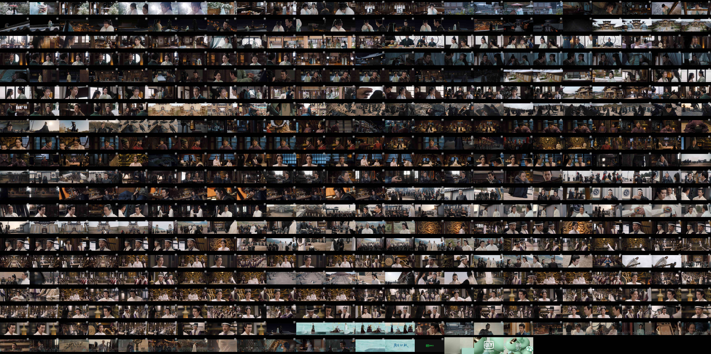
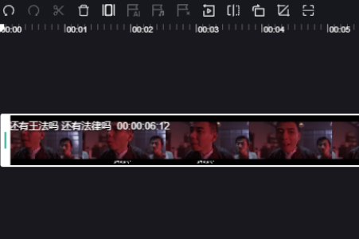

# VCSpriteGenerator
A simple css sprite generator for video, and the the output as below.

## Application scenario

<figure>

</figure>

## Runtime Env

- jdk1.8+
- FFmpeg

## Next Plan

- [ ] A fluent interface to running FFmpeg from Java.
- [ ] Concurrent & Asynchronous support.
- [ ] Interrupt & resume task.
- [ ] Maybe more...